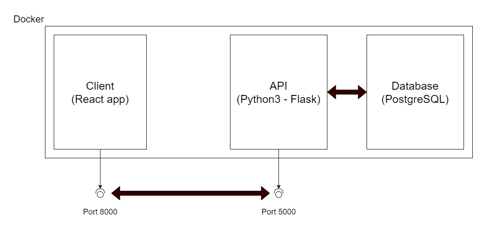

## Quiz App

App for creating and solving quizzes written in python (flask) as backend, react as frontend and postgreSQL as database.

### Run

The easiest way is run by docker-compose command on linux.

`docker-compose up`

After the app starts, go to [localhost:8000](http://localhost:8000)

### App structure

### Usage

